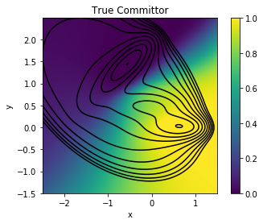
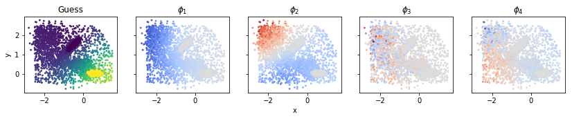
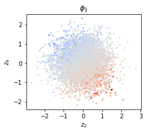
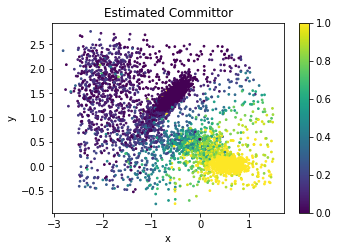
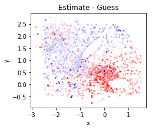
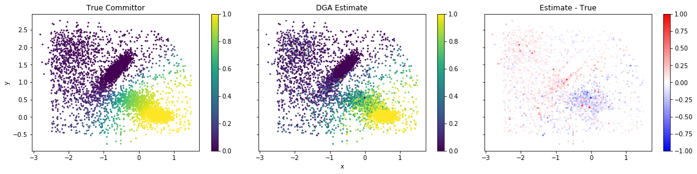

Committor Estimate on the Muller-Brown Potential
================================================

.. code:: python

    import matplotlib.pyplot as plt
    import numpy as np
    import pyedgar
    from pyedgar.data_manipulation import tlist_to_flat, flat_to_tlist
    
    %matplotlib inline

Load Data and set Hyperparameters
---------------------------------

We first load in the pre-sampled data. The data consists of 1000 short
trajectories, each with 5 datapoints. The precise sampling procedure is
described in "Galerkin Approximation of Dynamical Quantities using
Trajectory Data" by Thiede et al. Note that this is a smaller dataset
than in the paper. We use a smallar dataset to ensure the diffusion map
basis construction runs in a reasonably short time.

Set Hyperparameters
~~~~~~~~~~~~~~~~~~~

Here we specify a few hyperparameters. Thes can be varied to study the
behavior of the scheme in various limits by the user.

.. code:: python

    ntraj = 1000
    trajectory_length = 5
    dim = 10

Load and format the data
~~~~~~~~~~~~~~~~~~~~~~~~

.. code:: python

    trajs = np.load('data/muller_brown_trajs.npy')[:ntraj, :trajectory_length, :dim] # Raw trajectory
    stateA = np.load('data/muller_brown_stateA.npy')[:ntraj, :trajectory_length] # 1 if in state A, 0 otherwise
    stateB = np.load('data/muller_brown_stateB.npy')[:ntraj, :trajectory_length] # 1 if in state B, 0 otherwise
    
    print("Data shape: ", trajs.shape)
    
    # Convert to list of trajectories format
    trajs = [traj_i for traj_i in trajs]
    stateA = [A_i for A_i in stateA]
    stateB = [B_i for B_i in stateB]

.. parsed-literal::

    Data shape:  (1000, 5, 10)

We also convert the data into the flattened format. This converts the
data into a 2D array, which allows the data to be passed into many ML
packages that require a two-dimensional dataset. In particular, this is
the format accepted by the Diffusion Atlas object. Trajectory start/stop
points are then stored in the traj\_edges array.

.. code:: python

    flattened_trajs, traj_edges = tlist_to_flat(trajs)
    flattened_stateA = np.hstack(stateA)
    flattened_stateB = np.hstack(stateB)
    print("Flattened Shapes are: ", flattened_trajs.shape, flattened_stateA.shape, flattened_stateB.shape,)

.. parsed-literal::

    Flattened Shapes are:  (5000, 10) (5000,) (5000,)

Finally, we load the reference, "true" committor for comparison.

.. code:: python

    ref_comm = np.load('reference/reference_committor.npy')
    ref_potential = np.load('reference/potential.npy')
    xgrid = np.load('reference/xgrid.npy')
    ygrid = np.load('reference/ygrid.npy')

.. code:: python

     # Plot the true committor.
    fig, ax = plt.subplots(1)
    HM = ax.pcolor(xgrid, ygrid, ref_comm, vmin=0, vmax=1)
    ax.contour(xgrid, ygrid, ref_potential, levels=np.linspace(0, 10., 11), colors='k') # Contour lines every 1 k_B T
    ax.set_aspect('equal')
    cbar = plt.colorbar(HM, ax=ax)
    
    ax.set_xlabel('x')
    ax.set_ylabel('y')
    ax.set_title('True Committor')

.. parsed-literal::

    Text(0.5,1,'True Committor')

Construct DGA Committor
-----------------------

We now use PyEDGAR to build an estimate for the forward committor.

Build Basis Set
~~~~~~~~~~~~~~~

We first build the basis set required for the DGA Calculation. In this
demo, we will use the diffusion map basis.

.. code:: python

    diff_atlas = pyedgar.basis.DiffusionAtlas.from_sklearn(alpha=0, k=500, bandwidth_type='-1/d', epsilon='bgh_generous')
    diff_atlas.fit(flattened_trajs)

.. parsed-literal::

    <pyedgar.basis.DiffusionAtlas at 0x7fab1ef29748>

Here, we construct the basis and guess functions, and convert them back
into lists of trajectories. The domain is the set of all sets out side
of :math:`(A\cup B)^c`.

.. code:: python

    flat_basis, evals = diff_atlas.make_dirichlet_basis(300, in_domain=(1. - flattened_stateA - flattened_stateB), return_evals=True)
    flat_guess = diff_atlas.make_FK_soln(flattened_stateB, in_domain=(1. - flattened_stateA - flattened_stateB))
    
    basis = flat_to_tlist(flat_basis, traj_edges)
    guess = flat_to_tlist(flat_guess, traj_edges)

We plot the guess function and the first few basis functions.

.. code:: python

    fig, axes= plt.subplots(1, 5, figsize=(14,4.), sharex=True, sharey=True)
    axes[0].scatter(flattened_trajs[:,0], flattened_trajs[:,1], 
                    c=flat_guess, s=3)
    axes[0].set_title('Guess')
    axes[0].set_ylabel("y")
    
    for i, ax in enumerate(axes[1:]):
        vm = np.max(np.abs(flat_basis[:, i]))
        ax.scatter(flattened_trajs[:,0], flattened_trajs[:,1], 
                   c=flat_basis[:, i], s=3, cmap='coolwarm', 
                   vmin=-1*vm, vmax=vm)
        ax.set_title(r"$\phi_%d$" % (i+1))
    
    for ax in axes:
        ax.set_aspect('equal')
    #     ax.
    axes[2].set_xlabel("x")

.. parsed-literal::

    Text(0.5,0,'x')

The third basis function looks like noise from the perspective of the
:math:`x` and :math:`y` coordinates. This is because it correlates most
strongly with the harmonic degrees of freedom. Note that due to the
boundary conditions, it is not precisely the dominant eigenvector of the
harmonic degrees of freedom.

.. code:: python

    fig, (ax1) = plt.subplots(1, figsize=(3.5,3.5))
    
    vm = np.max(np.abs(flat_basis[:,2]))
    ax1.scatter(flattened_trajs[:,3], flattened_trajs[:,5], 
                c=flat_basis[:, 2], s=3, cmap='coolwarm', 
                vmin=-1*vm, vmax=vm)
    
    ax1.set_aspect('equal')
    ax1.set_title(r"$\phi_%d$" % 3)
    ax1.set_xlabel("$z_2$")
    ax1.set_ylabel("$z_4$")

.. parsed-literal::

    Text(0,0.5,'$z_4$')

Build the committor function
~~~~~~~~~~~~~~~~~~~~~~~~~~~~

We are ready to compute the committor function using DGA. This can be
done by passing the guess function and the basis to the the Galerkin
module.

.. code:: python

    g = pyedgar.galerkin.compute_committor(basis, guess, lag=1)

.. code:: python

    fig, (ax1) = plt.subplots(1, figsize=(5.5,3.5))
    
    SC = ax1.scatter(flattened_trajs[:,0], flattened_trajs[:,1], c=np.array(g).ravel(), vmin=0., vmax=1., s=3)
    
    ax1.set_xlabel('x')
    ax1.set_ylabel('y')
    ax1.set_title('Estimated Committor')
    plt.colorbar(SC)
    ax1.set_aspect('equal')

Here, we plot how much the DGA estimate perturbs the Guess function

.. code:: python

    fig, (ax1) = plt.subplots(1, figsize=(3.5,3.5))
    
    ax1.scatter(flattened_trajs[:,0], flattened_trajs[:,1], c=np.array(g).ravel() - flat_guess, 
                vmin=-.5, vmax=.5, cmap='bwr', s=3)
    ax1.set_aspect('equal')
    ax1.set_xlabel('x')
    ax1.set_ylabel('y')
    ax1.set_title('Estimate - Guess')

.. parsed-literal::

    Text(0.5,1,'Estimate - Guess')

Compare against reference
-------------------------

To compare against the reference values, we will interpolate the
reference onto the datapoints usingy scipy's interpolate package.

.. code:: python

    import scipy.interpolate as spi
    
    spline = spi.RectBivariateSpline(xgrid, ygrid, ref_comm.T)
    ref_comm_on_data = np.array([spline.ev(c[0], c[1]) for c in flattened_trajs[:,:2]])
    ref_comm_on_data[ref_comm_on_data < 0.] = 0.
    ref_comm_on_data[ref_comm_on_data > 1.] = 1.

A comparison of our estimate with the True committor. While the estimate
is good, we systematically underestimate the committor near (0, 0.5).

.. code:: python

    fig, axes = plt.subplots(1, 3, figsize=(16,3.5), sharex=True, sharey=True)
    (ax1, ax2, ax3) = axes
    SC = ax1.scatter(flattened_trajs[:,0], flattened_trajs[:,1], c=ref_comm_on_data, vmin=0., vmax=1., s=3)
    plt.colorbar(SC, ax=ax1)
    SC = ax2.scatter(flattened_trajs[:,0], flattened_trajs[:,1], c=np.array(g).ravel(), vmin=0., vmax=1., s=3)
    plt.colorbar(SC, ax=ax2)
    SC = ax3.scatter(flattened_trajs[:,0], flattened_trajs[:,1], c=np.array(g).ravel() -ref_comm_on_data, 
                     vmin=-1, vmax=1, s=3, cmap='bwr')
    plt.colorbar(SC, ax=ax3)
    
    
    # ax1.set_aspect('equal')
    ax2.set_xlabel('x')
    ax1.set_ylabel('y')
    ax1.set_title('True Committor')
    ax2.set_title('DGA Estimate')
    ax3.set_title('Estimate - True')
    plt.tight_layout(pad=-1.)
    for ax in axes:
        ax.set_aspect('equal')

