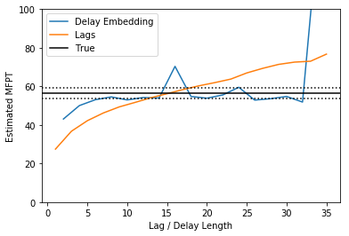

Delay Embedding and the MFPT
============================

Here, we give an example script, showing the effect of Delay Embedding
on a Brownian motion on the Muller-Brown potential, projeted onto its
y-axis. This script may take a long time to run, as considerable data is
required to accurately reconstruct the hidden degrees of freedom.

.. code:: python

    import matplotlib.pyplot as plt
    import numpy as np
    import pyedgar
    from pyedgar.data_manipulation import tlist_to_flat, flat_to_tlist, delay_embed, lift_function
    
    %matplotlib inline

Load Data and set Hyperparameters
---------------------------------

We first load in the pre-sampled data. The data consists of 400 short
trajectories, each with 30 datapoints. The precise sampling procedure is
described in "Galerkin Approximation of Dynamical Quantities using
Trajectory Data" by Thiede et al. Note that this is a smaller dataset
than in the paper. We use a smallar dataset to ensure the diffusion map
basis construction runs in a reasonably short time.

Set Hyperparameters
~~~~~~~~~~~~~~~~~~~

Here we specify a few hyperparameters. Thes can be varied to study the
behavior of the scheme in various limits by the user.

.. code:: python

    ntraj = 700
    trajectory_length = 40
    lag_values = np.arange(1, 37, 2)
    embedding_values = lag_values[1:] - 1

Load and format the data
~~~~~~~~~~~~~~~~~~~~~~~~

.. code:: python

    trajs_2d = np.load('data/muller_brown_trajs.npy')[:ntraj, :trajectory_length] # Raw trajectory
    trajs = trajs_2d[:, :, 1] # Only keep y coordinate
    stateA = (trajs > 1.15).astype('float')
    stateB = (trajs < 0.15).astype('float')
    
    # Convert to list of trajectories format
    trajs = [traj_i.reshape(-1, 1) for traj_i in trajs]
    stateA = [A_i for A_i in stateA]
    stateB = [B_i for B_i in stateB]
    
    # Load the true results
    true_mfpt = np.load('data/htAB_1_0_0_1.npy')

We also convert the data into the flattened format. This converts the
data into a 2D array, which allows the data to be passed into many ML
packages that require a two-dimensional dataset. In particular, this is
the format accepted by the Diffusion Atlas object. Trajectory start/stop
points are then stored in the traj\_edges array.

.. code:: python

    flattened_trajs, traj_edges = tlist_to_flat(trajs)
    flattened_stateA = np.hstack(stateA)
    flattened_stateB = np.hstack(stateB)
    print("Flattened Shapes are: ", flattened_trajs.shape, flattened_stateA.shape, flattened_stateB.shape,)

.. parsed-literal::

    Flattened Shapes are:  (28000, 1) (28000,) (28000,)

Construct DGA MFPT by increasing lag times
------------------------------------------

We first construct the MFPT with increasing lag times.

.. code:: python

    # Build the basis set
    diff_atlas = pyedgar.basis.DiffusionAtlas.from_sklearn(alpha=0, k=500, bandwidth_type='-1/d', epsilon='bgh_generous')
    diff_atlas.fit(flattened_trajs)
    flat_basis = diff_atlas.make_dirichlet_basis(200, in_domain=(1. - flattened_stateA))
    basis = flat_to_tlist(flat_basis, traj_edges)
    flat_basis_no_boundaries = diff_atlas.make_dirichlet_basis(200)
    basis_no_boundaries = flat_to_tlist(flat_basis_no_boundaries, traj_edges)

.. code:: python

    # Perform DGA calculation
    mfpt_BA_lags = []
    for lag in lag_values:
        mfpt = pyedgar.galerkin.compute_mfpt(basis, stateA, lag=lag)
        pi = pyedgar.galerkin.compute_change_of_measure(basis_no_boundaries, lag=lag)
        flat_pi = np.array(pi).ravel()
        flat_mfpt = np.array(mfpt).ravel()
        mfpt_BA = np.mean(flat_mfpt * flat_pi * np.array(stateB).ravel()) / np.mean(flat_pi * np.array(stateB).ravel())
        mfpt_BA_lags.append(mfpt_BA)

Construct DGA MFPT with increasing Delay Embedding
--------------------------------------------------

We now construct the MFPT using delay embedding. To accelerate the
process, we will only use every fifth value of the delay length.

.. code:: python

    mfpt_BA_embeddings = []
    for lag in embedding_values:
        # Perform delay embedding
        debbed_traj = delay_embed(trajs, n_embed=lag)
        lifted_A = lift_function(stateA, n_embed=lag)
        lifted_B = lift_function(stateB, n_embed=lag)
        
        flat_debbed_traj, embed_edges = tlist_to_flat(debbed_traj)
        flat_lifted_A = np.hstack(lifted_A)
            
        # Build the basis 
        diff_atlas = pyedgar.basis.DiffusionAtlas.from_sklearn(alpha=0, k=500, bandwidth_type='-1/d',
                                                               epsilon='bgh_generous', neighbor_params={'algorithm':'brute'})
        diff_atlas.fit(flat_debbed_traj)
        flat_deb_basis = diff_atlas.make_dirichlet_basis(200, in_domain=(1. - flat_lifted_A))
        deb_basis = flat_to_tlist(flat_deb_basis, embed_edges)
        
        flat_pi_basis = diff_atlas.make_dirichlet_basis(200)
        pi_basis = flat_to_tlist(flat_deb_basis, embed_edges)
        
        
        # Construct the Estimate
        deb_mfpt = pyedgar.galerkin.compute_mfpt(deb_basis, lifted_A, lag=1)
        pi = pyedgar.galerkin.compute_change_of_measure(pi_basis)
        flat_pi = np.array(pi).ravel()
        flat_mfpt = np.array(deb_mfpt).ravel()
        deb_mfpt_BA = np.mean(flat_mfpt * flat_pi * np.array(lifted_B).ravel()) / np.mean(flat_pi * np.array(lifted_B).ravel())
        mfpt_BA_embeddings.append(deb_mfpt_BA)

Plot the Results
----------------

We plot the results of our calculation, against the true value (black
line, with the standard deviation in stateB given by the dotted lines).
We see that increasing the lag time causes the mean-first-passage time
to grow unboundedly. In contrast, with delay embedding the
mean-first-passage time converges. We do, however, see one bad fluction
at a delay length of 16, and that as the the delay length gets
sufficiently long, the calculation blows up.

.. code:: python

    plt.plot(embedding_values, mfpt_BA_embeddings, label="Delay Embedding")
    plt.plot(lag_values, mfpt_BA_lags, label="Lags")
    plt.axhline(true_mfpt[0] * 10, color='k', label='True')
    plt.axhline((true_mfpt[0] + true_mfpt[1]) * 10., color='k', linestyle=':')
    plt.axhline((true_mfpt[0] - true_mfpt[1]) * 10., color='k', linestyle=':')
    
    plt.legend()
    plt.ylim(0, 100)
    
    plt.xlabel("Lag / Delay Length")
    plt.ylabel("Estimated MFPT")

.. parsed-literal::

    Text(0,0.5,'Estimated MFPT')

